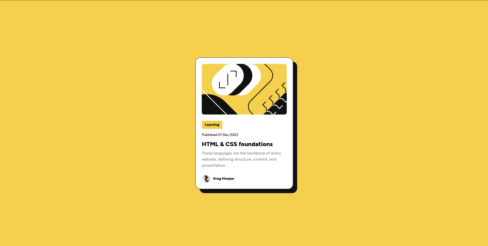
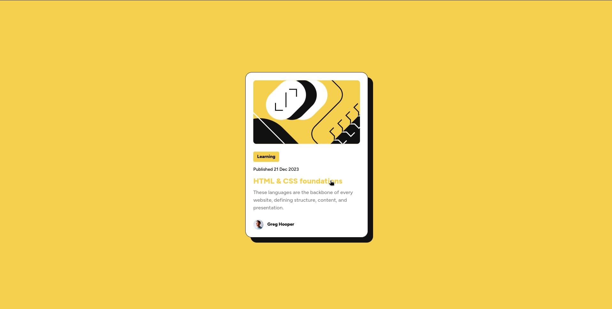

# Frontend Mentor - Blog preview card solution

This is a solution to the [Blog preview card challenge on Frontend Mentor](https://www.frontendmentor.io/challenges/blog-preview-card-ckPaj01IcS). Frontend Mentor challenges help you improve your coding skills by building realistic projects.

## Table of contents

- [Overview](#overview)
  - [The challenge](#the-challenge)
  - [Screenshot](#screenshot)
  - [Links](#links)
- [My process](#my-process)
  - [Built with](#built-with)
  - [What I learned](#what-i-learned)
- [Author](#author)

## Overview

### The challenge

Users should be able to:

- See hover and focus states for all interactive elements on the page

### Screenshot

<div style="display: flex; gap: 8px">
  
  
</div>

### Links

- Solution URL: [https://github.com/jleveneur/frontend-mentor-challenges/tree/main/challenges/blog-preview-card](https://github.com/jleveneur/frontend-mentor-challenges/tree/main/challenges/blog-preview-card)
- Live Site URL: [Add live site URL here](https://your-live-site-url.com)

## My process

### Built with

- Semantic HTML5 markup
- CSS custom properties
- Flexbox
- Mobile-first workflow

### What I learned

I learned how to use the `clamp()` function in CSS to set a font size that is responsive to the viewport width. This is useful for setting a minimum and maximum font size, as well as a font size that is proportional to the viewport width.

```css
h1 {
  font-size: clamp(1.5rem, 5vw, 2.5rem);
}
```

## Author

- Website - [Add your name here](https://www.your-site.com)
- Frontend Mentor - [@jleveneur](https://www.frontendmentor.io/profile/jleveneur)
- GitHub - [@jleveneur](https://github.com/jleveneur)
