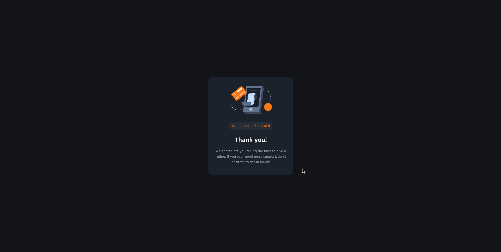

# Frontend Mentor - Interactive rating component solution

This is a solution to the [Interactive rating component challenge on Frontend Mentor](https://www.frontendmentor.io/challenges/interactive-rating-component-koxpeBUmI). Frontend Mentor challenges help you improve your coding skills by building realistic projects.

## Table of contents

- [Overview](#overview)
  - [The challenge](#the-challenge)
  - [Screenshot](#screenshot)
  - [Links](#links)
- [My process](#my-process)
  - [Built with](#built-with)
- [Author](#author)

**Note: Delete this note and update the table of contents based on what sections you keep.**

## Overview

### The challenge

Users should be able to:

- View the optimal layout for the app depending on their device's screen size
- See hover states for all interactive elements on the page
- Select and submit a number rating
- See the "Thank you" card state after submitting a rating

### Screenshot

  
  

  
  

### Links

- Solution URL: [https://github.com/jleveneur/frontend-mentor-challenges/tree/main/challenges/interactive-rating-component](https://github.com/jleveneur/frontend-mentor-challenges/tree/main/challenges/interactive-rating-component)
- Live Site URL: [Add live site URL here](https://your-live-site-url.com)

## My process

### Built with

- Semantic HTML5 markup
- CSS custom properties
- Flexbox
- Mobile-first workflow
- Vanilla JavaScript

## Author

- Website - [Add your name here](https://www.your-site.com)
- Frontend Mentor - [@jleveneur](https://www.frontendmentor.io/profile/jleveneur)
- GitHub - [@jleveneur](https://github.com/jleveneur)
