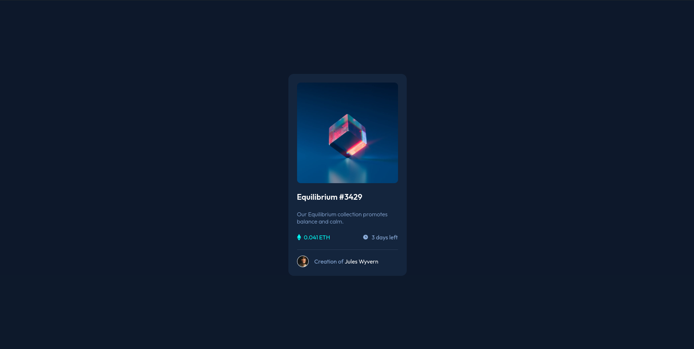
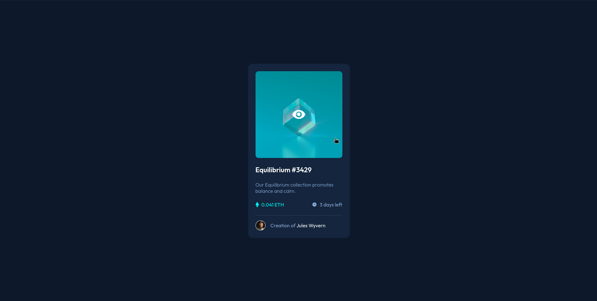

# Frontend Mentor - NFT preview card component solution

This is a solution to the [NFT preview card component challenge on Frontend Mentor](https://www.frontendmentor.io/challenges/nft-preview-card-component-SbdUL_w0U). Frontend Mentor challenges help you improve your coding skills by building realistic projects.

## Table of contents

- [Overview](#overview)
  - [The challenge](#the-challenge)
  - [Screenshot](#screenshot)
  - [Links](#links)
- [My process](#my-process)
  - [Built with](#built-with)
  - [What I learned](#what-i-learned)
- [Author](#author)

**Note: Delete this note and update the table of contents based on what sections you keep.**

## Overview

### The challenge

Users should be able to:

- View the optimal layout depending on their device's screen size
- See hover states for interactive elements

### Screenshot

<div style="display: flex; gap: 8px">
  
  
</div>

### Links

- Solution URL: [https://github.com/jleveneur/frontend-mentor-challenges/tree/main/challenges/nft-preview-card-component](https://github.com/jleveneur/frontend-mentor-challenges/tree/main/challenges/nft-preview-card-component)
- Live Site URL: [Add live site URL here](https://your-live-site-url.com)

## My process

### Built with

- Semantic HTML5 markup
- CSS custom properties
- Flexbox
- Mobile-first workflow
- BEM methodology

### What I learned

I learned more about BEM methodology and how to use it in my projects.

```css
.block__element--modifier {
  display: flex;
  justify-content: center;
  align-items: center;
}
```

## Author

- Website - [Add your name here](https://www.your-site.com)
- Frontend Mentor - [@jleveneur](https://www.frontendmentor.io/profile/jleveneur)
- GitHub - [@jleveneur](https://github.com/jleveneur)
