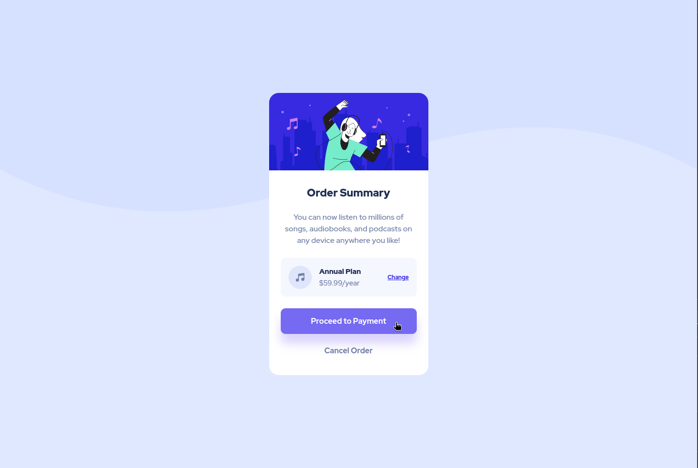

# Frontend Mentor - Order summary card solution

This is a solution to the [Order summary card challenge on Frontend Mentor](https://www.frontendmentor.io/challenges/order-summary-component-QlPmajDUj). Frontend Mentor challenges help you improve your coding skills by building realistic projects.

## Table of contents

- [Overview](#overview)
  - [The challenge](#the-challenge)
  - [Screenshot](#screenshot)
  - [Links](#links)
- [My process](#my-process)
  - [Built with](#built-with)
  - [What I learned](#what-i-learned)
- [Author](#author)

## Overview

### The challenge

Users should be able to:

- See hover states for interactive elements

### Screenshot




### Links

- Solution URL: [https://github.com/jleveneur/frontend-mentor-challenges/tree/main/challenges/order-summary-card-component](https://github.com/jleveneur/frontend-mentor-challenges/tree/main/challenges/order-summary-card-component)
- Live Site URL: [Add live site URL here](https://your-live-site-url.com)

## My process

### Built with

- Semantic HTML5 markup
- CSS custom properties
- Flexbox
- Mobile-first workflow
- BEEM methodology

### What I learned

I learned how to use the `background-image` property in CSS to add a background image to a div.

```css
.card {
  background-image: url('images/pattern-background-desktop.svg');
  background-size: cover;
  background-repeat: no-repeat;
  background-position: center;
}
```

I also learned how to use the `box-shadow` property to add a shadow to a div.

```css
.card {
  box-shadow: 0px 10px 20px rgba(0, 0, 0, 0.1);
}
```

## Author

- Website - [Add your name here](https://www.your-site.com)
- Frontend Mentor - [@jleveneur](https://www.frontendmentor.io/profile/jleveneur)
- GitHub - [@jleveneur](https://github.com/jleveneur)
